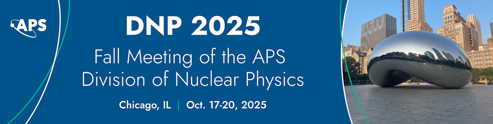

# Deep Learning Tutorials for Experimental Nuclear Physics

Welcome to the DNP 2025 Deep Learning Tutorials presented at APS-DNP 2025 Data Science Workshop sessions! This Jupyter Book provides comprehensive tutorials on applying deep learning techniques to experimental nuclear physics, specifically for the Forward Calorimeter (FCAL) at GlueX.

## Overview

These tutorials are designed for Nuclear and Paricle Physics and Researchers. We focus on two main applications of deep learning:

1. **CNN-based Classification**: Using Convolutional Neural Networks to classify FCAL showers and distinguish between photons and splitoffs
2. **Generative AI**: Building generative models to simulate FCAL photon showers based on their kinematics.

## Tutorial Goals

By the end of these tutorials, you will be able to:

- Understand the physics behind FCAL showers and the importance of accurate classification
- Prepare and preprocess FCAL data for deep learning applications
- Build and train CNN models for binary classification (photons vs splitoffs)
- Develop generative models (GANs, VAEs, or diffusion models) for FCAL shower simulation
- Evaluate model performance using physics-informed metrics
- Apply these techniques to your own nuclear physics research

## Target Audience

These tutorials are intended for:
- Graduate students and postdocs in nuclear physics
- Researchers working on calorimeter systems
- Scientists interested in applying ML to experimental physics
- Anyone wanting to learn about deep learning in the context of particle physics

## Prerequisites

- Basic understanding of nuclear physics and particle detectors
- Python programming experience
- Familiarity with NumPy and basic data analysis
- (Optional) Prior exposure to machine learning concepts

## Dataset and models

Dataset used in this tutorial: [](https://huggingface.co/datasets/AI4EIC/DNP2025-tutorial)

The trained models are archived for easy access and reproducibility.
You can explore and download them at: [](https://huggingface.co/AI4EIC/DNP2025-tutorial)


## Event Information

**DNP 2025 Tutorial Session**  
Date: October 17, 2025  
Location: Chicago, IL  
Workshop Sessions: [1WD](https://schedule.aps.org/dnp/2025/events/1WD/2), [2WD](https://schedule.aps.org/dnp/2025/events/2WD/2)



For questions or feedback, please open an issue on our [GitHub repository](https://github.com/ai4eic/DNP2025-tutorials).

---


```{admonition} Authors Acknowledgements to GlueX
:class: dropdrown
* This tutorial is part of the AI4EIC collaboration’s effort to bring modern machine learning techniques to experimental nuclear physics.

* We gratefully acknowledge the [GlueX Collaboration](https://gluex.org/) for the software framework and the public release of the Monte Carlo simulation data used in this work [GlueX acknowledgements](https://gluex.org/thanks.html).
```

```{tableofcontents}
```